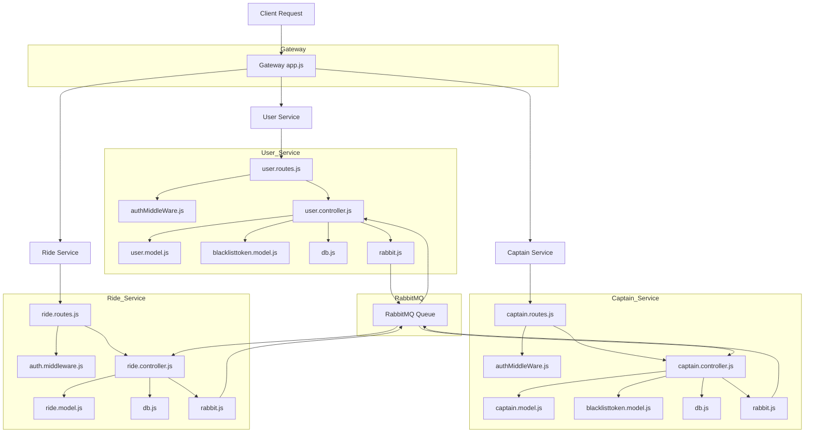

# Microservices Architecture

Our application uses a microservices architecture with a gateway routing requests to three core services. These services communicate with each other through RabbitMQ.

## Architecture Diagram

## Service Overview

- **Gateway Service**: Routes client requests to appropriate microservices
- **User Service**: Manages user authentication, profiles, and preferences
- **Captain Service**: Handles driver/captain management, availability, and profiles
- **Ride Service**: Processes ride requests, matching, tracking, and payments

## Communication

Services communicate with each other through:
- RESTful APIs for synchronous requests
- RabbitMQ message queue for asynchronous events
